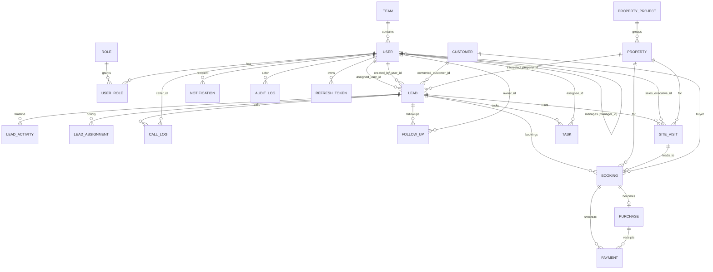

# Database Schema — Shri Trishakti Infra Realtors CRM

PostgreSQL 14+ (16 in Docker / Render). Every table has `id BIGINT GENERATED BY DEFAULT AS IDENTITY PK`,
`created_at`, `updated_at`, `created_by`, `updated_by` (JPA auditing) and a `version` optimistic-lock
column. Soft-delete via `deleted BOOLEAN` where relevant.

Where a column is listed below as **ENUM**, that names the Java enum's value set — physically it is a
`VARCHAR` (`@Enumerated(STRING)`), so no native database enum types are created. `users` and `leads`
are pluralised because `USER` is reserved in PostgreSQL and `LEAD` is a reserved window-function name.

## ER Diagram

## Tables

### Identity & Org

**role** — `id`, `name` (ENUM: ADMIN, SALES_MANAGER, CALLING_TEAM, SALES_EXECUTIVE), `description`.

**team** — `id`, `name`, `description`, `manager_id → user`.

**user** — `id`, `full_name`, `username` (unique), `email` (unique), `password_hash`, `phone`,
`team_id → team`, `manager_id → user`, `active BOOLEAN`, `last_login_at`, audit cols.

**user_role** — `user_id → user`, `role_id → role` (composite PK).

**refresh_token** — `id`, `user_id → user`, `token_hash`, `expires_at`, `revoked BOOLEAN`, `created_at`.

### Property

**property_project** — `id`, `name`, `location`, `city`, `description`, `active`.
(A launch / advertisement campaign container, e.g. "Trishakti Green Villas".)

**property** — `id`, `project_id → property_project`, `title`, `property_type`
(ENUM: FLAT, VILLA, PLOT, OFFICE_SPACE, COMMERCIAL, PENTHOUSE, ROW_HOUSE), `unit_number`,
`location`, `city`, `area_sqft DECIMAL`, `price DECIMAL`, `bedrooms`, `bathrooms`, `facing`,
`status` (ENUM: AVAILABLE, HELD, BOOKED, SOLD), `description`, audit cols.
Indexes: `(property_type, status)`, `(city, location)`.

### Customer

**customer** — `id`, `full_name`, `mobile` (unique, indexed), `alt_mobile`, `email`, `address`,
`city`, `id_proof_type`, `id_proof_number`, `notes`, `source_lead_id → lead`, audit cols.

### Lead (core)

**leads** — (pluralised: `LEAD` is a reserved window-function name)
| column | type | notes |
|--------|------|-------|
| id | BIGINT PK | exposed as `LD-{id}` |
| customer_name | VARCHAR(150) | |
| mobile | VARCHAR(20) | indexed |
| email | VARCHAR(150) | |
| source | VARCHAR(80) | advertisement / campaign name |
| source_channel | ENUM | FACEBOOK, GOOGLE, INSTAGRAM, NEWSPAPER, HOARDING, WALK_IN, REFERRAL, PORTAL_99ACRES, PORTAL_MAGICBRICKS, WEBSITE, OTHER |
| property_type | ENUM | FLAT, VILLA, PLOT, OFFICE_SPACE, COMMERCIAL, PENTHOUSE, ROW_HOUSE |
| budget_min / budget_max | DECIMAL(14,2) | |
| preferred_location | VARCHAR(150) | |
| status | ENUM | see workflow |
| assigned_user_id | FK → user | nullable |
| created_by_user_id | FK → user | |
| interested_property_id | FK → property | nullable |
| converted_customer_id | FK → customer | set on booking |
| next_follow_up_at | TIMESTAMP | indexed (dashboard "today's follow-ups") |
| last_contacted_at | TIMESTAMP | |
| notes | TEXT | |
| lost_reason | VARCHAR(255) | |
| priority | ENUM HOT/WARM/COLD | |
| deleted | BOOLEAN | |
| created_at / updated_at / created_by / updated_by | | auditing |

Indexes: `(status)`, `(assigned_user_id, status)`, `(next_follow_up_at)`, `(mobile)`, `(source_channel)`, `(created_at)`.

**lead_status** ENUM values: `NEW, ASSIGNED, CALLING, CONNECTED, NOT_CONNECTED, INTERESTED, NOT_INTERESTED, SITE_VISIT_SCHEDULED, SITE_VISIT_DONE, NEGOTIATION, BOOKING, PURCHASED, CLOSED, LOST`.

**lead_assignment** — `id`, `lead_id → lead`, `from_user_id → user`, `to_user_id → user`,
`assigned_by_id → user`, `reason`, `assigned_at`. (assignment history)

**lead_activity** — `id`, `lead_id → lead`, `type` (ENUM: CREATED, ASSIGNED, STATUS_CHANGE, CALL,
NOTE, FOLLOW_UP_SET, SITE_VISIT, BOOKING, PAYMENT, IMPORT, SYSTEM), `from_status`, `to_status`,
`summary`, `detail TEXT`, `actor_user_id → user`, `occurred_at`. Index `(lead_id, occurred_at)`.

### Calling & Follow-up

**call_log** — `id`, `lead_id → lead`, `caller_id → user`, `direction` (OUTBOUND/INBOUND),
`outcome` (ENUM: CONNECTED, NO_ANSWER, BUSY, WRONG_NUMBER, SWITCHED_OFF, CALL_BACK_LATER,
NOT_REACHABLE), `disposition` (ENUM: INTERESTED, NOT_INTERESTED, FOLLOW_UP, SITE_VISIT, DNC),
`duration_seconds`, `notes TEXT`, `called_at`, `next_follow_up_at`.
Index `(lead_id, called_at)`, `(caller_id, called_at)`.

**follow_up** — `id`, `lead_id → lead`, `owner_id → user`, `due_at` (indexed), `channel`
(CALL/WHATSAPP/EMAIL/MEETING), `status` (PENDING/DONE/MISSED/CANCELLED), `notes`, `completed_at`,
`notified BOOLEAN`.

### Site Visit

**site_visit** — `id`, `lead_id → lead`, `property_id → property`, `sales_executive_id → user`,
`scheduled_at` (indexed), `status` (ENUM: SCHEDULED, RESCHEDULED, COMPLETED, NO_SHOW, CANCELLED),
`result` (ENUM: INTERESTED, NEEDS_FOLLOW_UP, NOT_INTERESTED, READY_TO_BOOK), `feedback TEXT`,
`pickup_required BOOLEAN`, `completed_at`, `rating INTEGER`.

### Sales / Purchase

**booking** — `id`, `lead_id → lead`, `site_visit_id → site_visit`, `property_id → property`,
`customer_id → customer`, `sales_executive_id → user`, `booking_number` (unique),
`status` (ENUM: NEGOTIATION, TENTATIVE, CONFIRMED, CANCELLED, CONVERTED), `quoted_price DECIMAL`,
`negotiated_price DECIMAL`, `discount DECIMAL`, `token_amount DECIMAL`, `booking_date`,
`expected_closure_date`, `notes TEXT`, `cancel_reason`.

**purchase** — `id`, `booking_id → booking` (unique), `property_id → property`, `customer_id → customer`,
`sale_deed_number`, `final_price DECIMAL`, `total_paid DECIMAL`, `balance DECIMAL`,
`status` (ENUM: IN_PROGRESS, COMPLETED, REGISTERED, HANDED_OVER), `agreement_date`,
`registration_date`, `possession_date`.

**payment** — `id`, `booking_id → booking` (nullable), `purchase_id → purchase` (nullable),
`type` (ENUM: TOKEN, DOWN_PAYMENT, INSTALLMENT, REGISTRATION, MAINTENANCE, OTHER),
`mode` (ENUM: CASH, UPI, NEFT, RTGS, CHEQUE, CARD, LOAN_DISBURSAL),
`amount DECIMAL`, `due_date`, `paid_date`, `status` (ENUM: DUE, PAID, PARTIAL, OVERDUE, WAIVED),
`reference_number`, `remarks`.

### Tasks, Notifications, Audit

**task** — `id`, `title`, `description`, `type` (ENUM: FOLLOW_UP, CALLBACK, SITE_VISIT_PREP,
DOCUMENT, PAYMENT_COLLECTION, GENERAL), `assignee_id → user`, `lead_id → lead` (nullable),
`due_at` (indexed), `priority` (LOW/MEDIUM/HIGH/URGENT), `status` (OPEN/IN_PROGRESS/DONE/CANCELLED),
`reminder_at`, `notified BOOLEAN`, `completed_at`.

**notification** — `id`, `recipient_id → user`, `type`, `title`, `body`, `entity_type`, `entity_id`,
`read BOOLEAN` (indexed with recipient), `read_at`, `created_at`.

**audit_log** — `id`, `actor_user_id → user`, `action` (VARCHAR), `entity_type`, `entity_id`,
`before_json TEXT`, `after_json TEXT`, `ip_address`, `user_agent`, `at TIMESTAMP` (indexed).

## Referential integrity

- All FKs `ON DELETE RESTRICT` except history/child tables (`lead_activity`, `call_log`,
  `follow_up`, `notification`, `audit_log`) which are `ON DELETE CASCADE` from their parent.
- `booking.property_id` and `purchase.property_id` `RESTRICT` (a sold unit cannot be deleted).

See [`schema.sql`](schema.sql) for full DDL.
